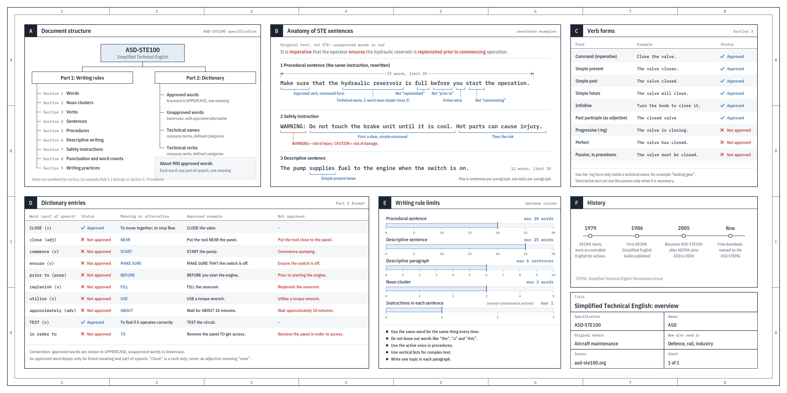

# Karpathy：We'll be spending a lot more time trying to understand the outputs of language models

- 原始 URL：https://x.com/karpathy/status/2105819303471976479
- 作者：Andrej Karpathy (@karpathy)，认证个人账号，约 432 万粉丝；2026-05-19 起任职 Anthropic（https://x.com/karpathy/status/2056753169888334312 ）
- 形态：X 长推（note tweet），附图 1 张（3200×1600 PNG，ASD-STE100 速查图）
- 发布时间：2026-10-02 00:37:00 UTC（snowflake ID 解码与 fxtwitter API created_at 双重确证）
- 抓取日期：2026-10-08，经 fxtwitter 公共 API（api.fxtwitter.com）读取正文；x.com 直连返回 402。
  抓取时互动数据：7,585,945 views / 80,593 bookmarks / 54,484 likes / 6,403 retweets / 1,572 replies / 1,445 quotes；无 Community Note
- 附图：本地存档 `raw/assets/2026-10-02-Karpathy-ASD-STE100-速查图.png`（原图 https://pbs.twimg.com/media/HTlaHqgbwAAS1lv.png?name=orig ）。
  第三方核查指出图中词典表有误（approximately 标为不批准、TEST 标为批准动词等），见 [[LLM 输出的人类理解瓶颈]] 证据点表。
- 存档原因：[[LLM 输出的人类理解瓶颈]] 的核心一手来源（四级输出格式阶梯 + "工作上移到监督与理解"判断）。
- 正文为 verbatim（含原文语病 "LLMs well-versed in this language"），粗体标记按 API facets 还原。
> 存入后视为只读存档。

---

We'll be spending a lot more time trying to understand the outputs of language models. A few thoughts, tips & tricks:

**Writing**. Something I've had success with: Ask your LLM to explain something in ASD-STE100, it's a controlled language specification originally developed for aerospace maintenance documentation. LLMs well-versed in this language and it comes with heavy constraints on clean writing style that I often find a lot more readable. Sometimes I've tried to soften it a bit e.g. ask for "80% of the way to ASD-STE100" because the spec is quite stringent. But even better:

**Diagrams / images**. Instead of writing, ask your LLM to create a diagram. These can be a lot easier to process, parse, and understand. But even better:

**Web pages**. Ask for output "in HTML" to get a beautiful, interactive webpage. LLMs are getting really good at frontend and can create beautiful experiences, animations, etc. But even better:

**Explainer videos**. The output format I am most bullish on is fully custom / bespoke explainer videos generated on any arbitrary topic. Experiment with things like "Create a 3b1b style video explainer on X. Use my ElevenLabs API key for audio narration". (you'd need an API key for the latter or you can ask your LLM to find you decent free alternatives that use your local compute). This is actually starting to work!

**In summary:**
- As LLMs get better, they will do more and more of the legwork autonomously, and a lot more of our work will rise up the abstractions into oversight and understanding.
- Luckily, LLMs can help here too because as intelligence and code are increasingly abundant, you can ask for large, custom, discardable software artifacts (e.g. web apps, video explainers) that would have never made sense to create before. Push the boundaries here and you'll be surprised.

---

附图（原帖内嵌于 Writing 段；此处单独列出）：

