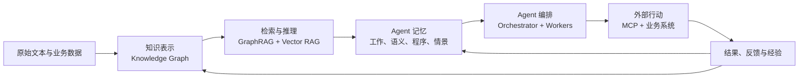

# 从知识图谱到 Agent 编排：知识、记忆与行动的完整架构

> ⚠️ 来源说明：本文不是原视频的逐字稿，而是基于逐字稿形成的系统性派生稿。
> 原视频由四段主题不同的内容拼接而成；本文通过重新编排建立统一架构。
> 本文件作为用户确认的结构化笔记冻结存档，不能作为 wiki 关键论断的一级来源。

## 一、核心命题

一个真正可用的 Agent 系统，需要连续回答四个问题：

| 问题 | 对应能力层 | 视频中的内容 |
|---|---|---|
| 世界中的知识如何表示？ | 知识表示层 | Knowledge Graph |
| 面对问题如何找到相关知识？ | 检索推理层 | GraphRAG / Vector RAG |
| 哪些信息需要跨会话保留？ | Agent 记忆层 | 四类记忆 |
| 如何调用外部系统完成目标？ | 行动编排层 | Orchestrator、Workers、MCP |

综合：四段内容可以重组为一条完整链路：



视频没有充分覆盖但生产环境必须补上的，是贯穿全链路的治理层：
Schema、来源追踪、权限、验证、审批、可观测、失败恢复和知识退役。

## 二、知识表示层：Knowledge Graph

知识图谱把现实世界抽象为：

- 节点：人、组织、产品、地点、事件等实体。
- 边：实体之间的关系。
- 属性：实体或关系附带的具体信息。

最小知识单元可以表达为：

> 实体 A — 关系 → 实体 B

例如：

> Paris — capital_of → France  
> John — collaborates_with → Jane

它的核心价值不是把数据“画成图”，而是把关系变成一等公民。传统表格擅长保存规则整齐的记录，
知识图谱更适合表达：

- 多对多关系；
- 多跳关系；
- 不同来源之间的实体关联；
- 会持续增加新类型的开放知识；
- 需要沿关系路径回答的问题。

### 构建流程

视频演示的流程是：

1. 输入非结构化文本；
2. LLM 提取实体和关系；
3. 用允许的节点与关系类型约束输出；
4. 转换成图文档；
5. 写入 Neo4j；
6. 检查图的节点、边和 Schema。

但“LLM 自动生成知识图谱”只是把劳动从手工录入转移到了治理环节，并没有消除成本。
生产系统还需要处理：

- 同一实体的不同名称；
- 重复节点合并；
- 错误关系和虚构实体；
- 时间有效性；
- 来源与证据；
- 置信度；
- Schema 演化。

因此，低 temperature 只能降低输出随机性，不能保证知识正确。

## 三、检索推理层：GraphRAG

视频中的 GraphRAG 实际由两个阶段组成。

### 1. 离线建图

```text
非结构化文本
→ LLM 提取实体和关系
→ 结构化图数据
→ 写入图数据库
```

### 2. 在线问答

```text
自然语言问题
→ LLM 生成 Cypher
→ 图数据库执行查询
→ 返回结构化结果
→ LLM 转换为自然语言答案
```

这里 LLM 承担三个不同职责：

- 信息抽取：从文本中识别实体与关系；
- 查询生成：把自然语言翻译成 Cypher；
- 答案表达：把数据库结果转换成人类语言。

这三步应分别验证，不能因为最终答案语言流畅，就默认实体抽取和查询逻辑都正确。

### GraphRAG 与 Vector RAG

| 维度 | Vector RAG | GraphRAG |
|---|---|---|
| 基本单元 | 文本 chunk | 实体、关系和子图 |
| 检索方式 | 向量相似度 | 图查询、路径与邻域 |
| 擅长问题 | 模糊语义召回、相似内容 | 多跳关系、关联分析、全局结构 |
| 主要风险 | 片段割裂、遗漏全局信息 | 建图错误、Schema 成本、Cypher 错误 |
| 数据准备 | 切块和 embedding | 实体抽取、消歧、关系建模 |
| 可解释性 | 返回相似片段 | 可展示实体与关系路径 |

综合：两者不是替代关系。

更合理的混合架构是：

1. Vector RAG 负责模糊召回相关文本；
2. GraphRAG 负责沿实体关系扩展上下文；
3. 原始文本负责提供可核验的证据；
4. LLM 负责综合表达，但不充当事实源。

知识图谱是索引和推理结构，不应取代原始材料作为 System of Record。
这与已有的 [[基于IT4IT的Agent知识治理]] 判断一致。

## 四、Agent 认知层：四类记忆

### 1. Working Memory：工作记忆

即当前上下文窗口，包括：

- 当前对话；
- 系统指令；
- 本轮读取的文件；
- 工具返回结果；
- 当前任务的中间状态。

它访问快，但容量有限、会话结束后通常消失。上下文窗口再大，也不等于长期记忆；
塞入过多内容还会降低模型对关键信息的注意力。

### 2. Semantic Memory：语义记忆

保存相对稳定的事实、规则和领域知识，例如：

- 项目架构；
- 业务术语；
- 编码规范；
- 产品文档；
- 用户偏好；
- 知识图谱或 Markdown Wiki。

语义记忆回答的是：

> “这个 Agent 长期知道什么？”

它不一定需要复杂的向量数据库或知识图谱。对于范围明确、人工可审阅的系统，
结构化 Markdown 往往更简单可靠。

### 3. Procedural Memory：程序记忆

保存“如何完成某类任务”，典型实现是 Skills：

- 什么情况下触发；
- 执行哪些步骤；
- 调用什么工具；
- 有哪些安全和验证规则；
- 需要加载哪些模板或脚本。

程序记忆回答的是：

> “这个 Agent 知道怎样做什么？”

Skills 使用 progressive disclosure：

1. 平时只加载技能名称和简介；
2. 任务命中后加载完整说明；
3. 执行到具体步骤时再读取模板、脚本和参考资料。

这样可以避免所有操作说明长期占用工作记忆。

### 4. Episodic Memory：情景记忆

保存过去发生过什么，以及从中学到了什么。

低质量实现是保存全部聊天记录；更好的实现是提炼可复用经验，例如：

> “上次认证故障的根因位于 middleware，而不是数据库。”

情景记忆的关键不是“多记”，而是三个判断：

- 什么值得记；
- 什么时候更新；
- 什么应该遗忘。

未经提炼的历史记录只是档案，不一定构成有用的记忆。

### 不同 Agent 的记忆配置

- 简单路由器：可能只需要工作记忆。
- 密码重置 Agent：需要工作记忆和程序记忆。
- 客服 Agent：还需要产品语义记忆。
- 编码或研究 Agent：通常四类记忆都需要。

综合：Chatbot 与 Agent 的真正差异不只是能否调用工具，而是输出能否受到持久知识、
既有程序和历史经验的共同约束。

## 五、行动层：Agent Orchestration

### Assistant 与 Agent

| Assistant | Agent |
|---|---|
| 等待 Prompt | 接受 Goal |
| 主要返回答案 | 追求业务结果 |
| 用户决定下一步 | 可在授权范围内决定下一步 |
| 以对话为中心 | 以状态变化和结果为中心 |

但“有自主性”不等于“无限授权”。Agent 的 agency 必须受目标、权限、风险门禁和验收条件限制。

### 编排模式

视频采用的是 Orchestrator–Workers 模式：

1. 主 Agent 理解整体目标；
2. 将任务拆给多个窄职责 Agent；
3. 每个 Worker 只处理一个明确环节；
4. 中间结果写入共享状态或 checkpoint；
5. 前序 Agent 释放，后续 Agent 接力；
6. 主 Agent 汇总结果并完成最终交付。

销售报价案例可拆为：

- Agent 1：判断是否进入报价阶段；
- Agent 2：提取客户和需求信息；
- Agent 3：匹配产品 SKU；
- Agent 4：验证产品兼容性和销售约束；
- Agent 5：计算价格；
- Agent 6：匹配法律条款；
- Agent 7：生成最终报价文档。

MCP 在这里承担连接层作用：业务系统通过 MCP Server 暴露数据和工具，
AI Host 内的 MCP Client 与其连接。视频把业务系统描述为“MCP Host”并不准确，参见 [[MCP]]。

### 与 RPA 的真实关系

视频把 Agent 编排描述为相对 RPA （Robotic Process Automation）的范式跃迁，但生产系统通常不是二选一：

- 确定性强、规则稳定的步骤继续使用代码或 Workflow；
- 需要理解模糊文本、动态规划的步骤交给 Agent；
- 高风险写操作设置确定性门禁和人工审批。

这与 [[building-effective-agents]] 的原则一致：优先使用足够简单的 Workflow，
只在路径不可预测时增加 Agent 自主性。

## 六、完整闭环

把四个部分连接起来，可得到一套完整 Agent 知识—行动循环：

1. 原始资料进入事实存档；
2. 提取实体、关系和可检索索引；
3. 用户提出问题或业务目标；
4. 混合检索召回文本与关联子图；
5. 相关知识进入工作记忆；
6. Agent 加载匹配的程序记忆；
7. Orchestrator 调度工具或 Worker；
8. 通过 MCP 读取或修改业务系统；
9. 对结果进行验证、审批和审计；
10. 将有复用价值的经验回写到语义或情景记忆；
11. 过时知识被更新、降权或退役。

这个闭环的关键不是“让模型记住一切”，而是让信息进入正确的层，并建立更新和遗忘机制。

## 七、与当前 llm-wiki 的映射

| 当前仓库组件 | 对应能力 |
|---|---|
| `raw/` | 不可变事实来源 |
| `wiki/entities/`、`concepts/`、`topics/` | 语义记忆 |
| Obsidian 双链 | 轻量知识图谱 |
| `AGENTS.md` 与 Skills | 程序记忆 |
| 当前对话和临时读取内容 | 工作记忆 |
| `analyses/`、`synthesis/` 中提炼的判断 | 经蒸馏的经验与长期知识 |
| `log.md` | 操作审计轨迹，不等同于记忆本身 |
| Query / Research / Lint | 检索、学习与知识保鲜循环 |
| lark-cli、MCP 等工具 | 外部行动层 |

综合：这个仓库本身已经是视频所描述架构的一个轻量实现。它没有采用 Neo4j，
但通过 Markdown 页面、双链、Schema 和持续维护，已经具备人工可审阅的语义网络。

## 八、内容边界与待补证据

这份视频适合作为入门线索，但不足以直接成为架构依据：

- 文件是四段视频的拼接，标题无法覆盖后半部分内容；
- 将知识图谱问答、Neo4j 查询和 GraphRAG 使用了较宽泛的统一称呼；
- 没有深入讨论实体消歧、证据追踪和图谱版本治理；
- 没有处理 LLM 生成错误 Cypher 的安全边界；
- Agent 编排案例缺少权限、幂等、超时、重试、补偿和人工审批；
- “每天创建 11,000 个 Agent”没有可靠证据，讲者也明确承认无法核实。

因此，正式沉淀时应以视频提供的结构为线索，再回到 COALA、GraphRAG、Neo4j、
LangChain、MCP 和 Agent Skills 的原始资料补证。

## 来源

- 原始视频：https://li.feishu.cn/file/CXkubLDs5oF6EUxJA9Ucedi7nBh
- 飞书妙记逐字稿：https://li.feishu.cn/minutes/obcn3k1m984k377lp91lojy1
- 读取日期：2026-07-28
