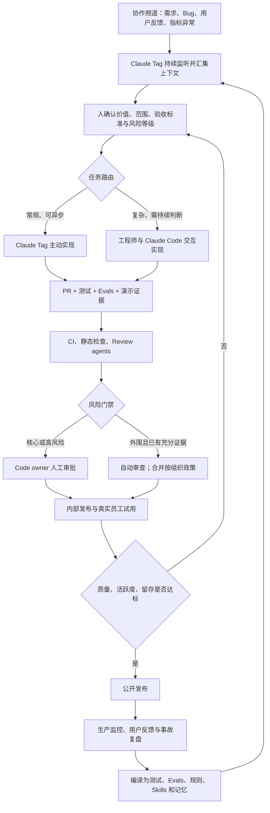

# Claude Tag 驱动的团队研发流程

## 核心判断

综合：Claude Tag 不是“放在 Slack 里的 Claude Code”，而是研发系统的**团队级常驻协作与执行层**：
它从协作频道接收事件，组装团队上下文，主动推进常规任务，并把产品、设计、工程和审查者拉进同一个会话。
[[Claude Code]] 继续承担个人与复杂任务的交互式执行；人则保留价值判断、风险政策、核心代码所有权和发布责任。

这使研发流程从“人领取工单 → 写代码 → 人审 PR”转向：

> **信号进入 → 意图固化 → Agent 路由与执行 → 证据化验证 → 按风险放权 → 内部试用 → 生产反馈编译回系统。**

这不是 Anthropic 发布的正式端到端 SOP，而是综合
[[2026-07-21-Simon-Willison-Claude-Code团队访谈-源摘要|Claude Code 团队访谈]]、
[[Anthropic-AI原生SDLC治理循环]]、[[Loop Engineering]] 与 [[Specification-Driven Development]]
推导出的可复用流程模型。

## 角色分工

| 角色 | 主要职责 | 不应承担 |
|---|---|---|
| Claude Tag | 持续监听协作信号、汇集上下文、协调多人、主动实现常规任务、发起 PR、维护频道记忆 | 决定产品价值、突破权限边界、替代高风险责任人 |
| Claude Code | 在工程师引导下处理复杂、需要持续交互和判断的实现任务 | 充当团队级事件总线或最终审批者 |
| 产品 / 工程 / 设计 | 定义用户问题、范围、体验与验收标准，处理跨职能取舍 | 对 Agent 逐条给出所有实现动作 |
| Code owner / 安全负责人 | 批准核心与高风险变更，维护风险政策和例外 | 为所有低风险变更逐行复核 |
| CI / Review agents / Evals | 提供功能、行为、安全与回归证据 | 把模型评分当作独立、无偏的最终裁决 |
| 用户与生产系统 | 提供留存、行为、故障和事故等真实结果 | 被内部 Demo 或一次通过率替代 |

综合：人的角色不是简单从“编码者”变成“监督者”，而是上移到四个控制点：**做什么、怎样算完成、
哪些权限可以委托、什么情况下必须停下来升级给人**。

## 端到端流程

### 1. 信号进入：频道成为事件入口

需求、bug、客户反馈和指标异常进入访问受控的项目频道。Claude Tag 可以持续监听，不必等待工程师领取工单；
它还可搜索公开内部讨论、代码和事件数据，补出问题背景。

综合：**频道应是事件总线，不应成为规格真相源。** 对话中的结论必须蒸馏成版本化产物，否则上下文虽丰富，
意图却会随聊天流和记忆更新静默漂移。

### 2. 意图固化：先定义“为什么和值不值得”

人确认用户问题、商业价值、范围、非目标、验收标准、风险等级和责任 owner；Claude Tag 可以起草，但不替人
决定产品价值。该步骤把频道信号转成 [[Specification-Driven Development|SDD]] 可以追踪的变更契约。

最小意图包包括：

- 问题与证据来源；
- 目标用户和预期结果；
- 范围、非目标与不可破坏的约束；
- 功能 / 行为 eval 与验收标准；
- 风险等级、数据和工具权限、责任 owner。

### 3. 任务路由：按协作形态分配 Agent

- 常规、边界清楚、可异步的工作交给 Claude Tag 主动推进；
- 复杂、需要连续探索和人工判断的任务进入“工程师 + Claude Code”交互循环；
- 产品、设计和工程需要共同调整时，继续在 Claude Tag 多人会话里接力，而不是在多个私有会话中复制上下文。

综合：路由依据应是任务的不确定性、风险和协作密度，而不是简单按“能否写代码”区分。

### 4. 实现：交付可验证的变更包

Agent 的产出不应止于代码或 PR。完整变更包至少包括：

1. spec delta / 任务目标；
2. 代码与配置变更；
3. 测试及 [[Evals|能力、行为 eval]]；
4. 本地运行、截图或录屏等体验证据；
5. 风险、权限与未解决问题；
6. owner 与审批记录。

这把“Agent 说已经完成”转换为可由 CI、reviewer 和人共同检查的证据链。

### 5. 验证与放权：形成双速流水线

所有变更先经过测试、CI、确定性检查和自动 review，再按风险分流：

- **核心 / 高风险路径**：code owner 必须人工审查和批准；
- **外围 / 低风险路径**：reviewer 先在 shadow mode 与人工结果对照，积累误报、漏报和历史事故覆盖；
  只有证据稳定后，才按文件或变更类型减少人工逐项检查。

[[2026-07-21-Simon-Willison-Claude-Code团队访谈-源摘要|访谈]]称 Claude Code 团队用了六个多月逐步扩大
外围自动审查。综合：自动化边界应由**变更位置 × 风险等级 × 历史失败覆盖**决定，不由一个全局“AI 已可信”
开关决定。

### 6. 内部试用：用真实使用过滤功能泛滥

新功能先交给员工和少量早期客户使用。功能类发布以活跃度、留存和质量为门槛；普通 bugfix 则以风险、
回归和结果验证为主，不应机械套用留存指标。

综合：代码生成变便宜后，真正稀缺的是用户注意力和产品复杂度预算。内部试用把发布判断从“已经实现”改为
“用户是否持续需要”。

### 7. 生产反馈：把失败编译回控制面

生产事故、用户抱怨和 review 漏检不只回到 backlog：

- 事故致因 PR → 回归测试与 reviewer eval；
- 重复缺陷 → `CLAUDE.md`、Skills 或确定性规则；
- 体验抱怨 → 行为 eval；
- 稳定团队偏好 → 经过准入后写入频道记忆；
- 权限异常或委托绕行 → 身份、工具和 agent-to-agent 策略收紧。

这一步把 [[Loop Engineering]] 的分钟级编码循环、小时级团队反馈和天 / 周级用户反馈，接到
[[Anthropic-AI原生SDLC治理循环|权限与事故治理循环]]上。

## 共享记忆的写回门禁

Claude Tag 当前以“每频道一个 Markdown 文件”保存共享记忆，但存储形式不等于治理。结合
[[Agent 记忆架构]]，团队至少需要定义：

| 记忆动作 | 最低规则 |
|---|---|
| Write | 只有稳定偏好、已确认决策和可复用事实可写入；原始讨论留在审计记录 |
| Update | 新旧结论冲突时保留来源和时间，由 owner 确认覆盖或并存 |
| Retrieve | 按频道、项目和角色授权，敏感上下文不能因“提高准确率”而默认公开 |
| Forget | 过期决策、撤销偏好和敏感信息按保留期退出 |
| Evaluate | 检查记忆是否改善任务结果，是否导致错误偏好被长期放大 |

综合：从会话写回频道主记忆应是一道显式门禁，不能把“会话可以贡献记忆”实现成无条件自动追加。

## 最小采用顺序

其它团队不应直接复制“65% PR”结果，而应按依赖顺序建设：

1. 建立版本化规格、测试 / eval、PR 与审批记录，明确各自 owner；
2. 给 Agent 独立身份，限制数据、工具、网络、凭证和可委托路径；
3. 先让 Claude Tag 只读搜索、总结和分流，验证上下文质量；
4. 开放起草 PR，但全部保留人工 review；
5. 自动 reviewer 先跑 shadow mode，用真实漏检与误报校准；
6. 只对证据充分的低风险范围减少人工逐项审查；
7. 接入内部试用、生产事故和用户反馈，闭合 eval、规则与记忆更新循环。

## 评价流程是否真的更好

不能用 PR 数量或代码行单独衡量，应同时观察：

| 维度 | 建议指标 |
|---|---|
| 价值 | 内部激活、留存、外部采用、功能退出率 |
| 流程 | lead time、等待决策时间、人工介入率、返工率 |
| 质量 | 逃逸缺陷率、回滚率、事故率、修复时间 |
| Evals | `pass^k`、覆盖增长、reviewer 漏报 / 误报、模型升级回归 |
| 安全 | 越权拦截、异常委托、凭证暴露、人工升级频率 |
| 人的体验 | 心流、认知负担、低价值监督时间、决策自主性 |

## 证据边界

- Claude Tag 的 65% 只指 Claude Code 产品工程团队的 PR 口径，不是全 Anthropic，也不是无人审查比例；
- 六个多月的审查放权周期、内部留存门槛及安全效果均为公司员工自述，缺少外部审计和结果对照；
- 本页流程包含跨页综合推断，适合作为试点假设，不应被包装成 Anthropic 已公开验证的标准方法；
- 流程是否改善净交付价值，必须用质量、事故、体验和用户结果共同验证。

## 关联页面

- [[Anthropic]] —— 本页实践的主体公司；65% 与 80% 两组口径的边界在该实体页并列
- [[Loop Engineering]]
- [[Specification-Driven Development]]
- [[SDD 开发规范研究]]
- [[Anthropic-AI原生SDLC治理循环]]
- [[Evals]]
- [[Agent 记忆架构]]
- [[生产力-体验悖论]]
- [[agent-生产级落地的鸿沟]]
