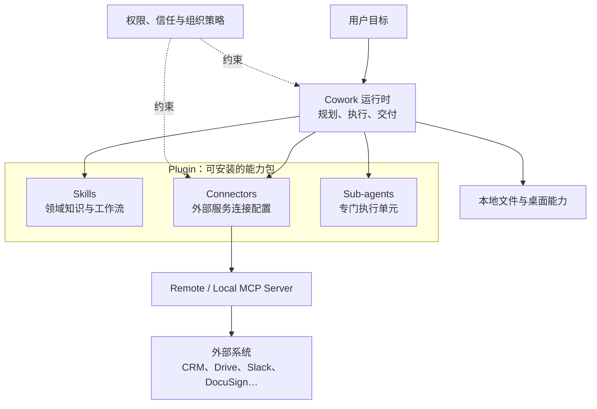

# Cowork 插件体系架构（对外讲解版）

> 2026-07-16 校正：Anthropic 已明确说明，**plugin 是 [[Agent Skills|skills]]、connectors、sub-agents 的组合包**，
> 不是 MCP Server 的同义词；其中 custom connector 才指向 remote MCP server，plugin 也可能包含
> local MCP server。旧版“插件 = MCP Server”模型已废弃。

## 校正后的机制图

> ⚠️ 历史资产：`raw/assets/cowork-plugins-mcp-architecture.svg` 把 plugin 画成 MCP Server，已失效。
> 因 `raw/` 只读而保留，仅供追溯，**不得继续用于对外讲解**。

## 分层解释

1. **Cowork 运行时**：接收目标，规划、调用能力并交付结果；能力模式参见
   [[building-effective-agents|Agent 架构]]。
2. **Plugin 能力包**：把适合某个岗位或工作流的 skills、connectors、sub-agents 预装在一起。
   Plugin 的价值是“开箱即用的组合”，不是单一网络协议端点。
3. **Connector 连接层**：让 Claude 接入外部服务。Custom connector 使用 remote MCP server；
   plugin 也可能包含在本机运行的 local MCP server。
4. **MCP Server**：真正暴露 Tools / Resources / Prompts 的协议端点。远程 connector 由 Anthropic
   云端发起连接，而不是从 Cowork 所在电脑的内网直接访问。
5. **System of record**：CRM、合同库、邮箱、数据仓库等仍保存权威业务事实；agent 通过 connector 调用它们。
6. **权限与信任边界**：connector 可能读取或修改外部数据，local MCP server 具有本机程序级权限；
   具体确认行为取决于工具、权限和组织策略，不能概括为“所有重要写操作必经人工确认”。

## 对外讲解话术（三个核心 talking point）

- **"从买软件到买结果"**：价值捕捉点从 UI/席位，转到“能力组合 + 任务执行 + 结果交付”。
- **"Plugin 是能力包"**：skills 告诉 agent 怎么做，connectors 让它接入系统，sub-agents 承担专门任务。
- **"MCP 是连接层标准"**：新增 custom connector 时可复用 MCP server，而不是为每个 agent 重写集成。

## 对外使用注意（诚实边界）

- **MCP** 是开放标准：对外应表述为“connector 可基于 MCP”，不能说“plugin 就是 MCP Server”。
- 图描述公开产品机制，不代表 Anthropic 的未公开内部微服务架构。
- “重要决策留给用户”可作为产品原则；具体操作是否弹出确认，必须按实际权限与工具行为说明。

## 相关
- 母题：[[cowork-saas-资本市场冲击]]（第 3 节·护城河穿透用到同一套"跨工具编排"逻辑）
- 实体/概念：[[Claude Cowork]]、[[MCP]]、[[building-effective-agents]]
