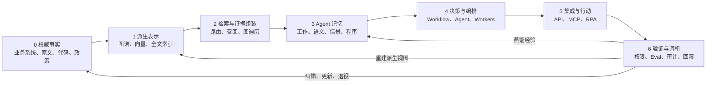

# 从知识图谱到 Agent 编排：知识、记忆与行动的闭环架构

> 定稿说明（2026-07-28）：本页以原视频和派生草稿为线索，回查 Microsoft GraphRAG、Neo4j、
> CoALA、Agent Skills、MCP、Anthropic 与 IBM 的一手资料后重写。原草稿保留在 `raw/sources/notes/`
> 作为不可变过程记录；本页是校正后的正式知识页。

## 核心判断

原草稿把内容串成“知识图谱 → GraphRAG → 四类记忆 → Agent 编排”的四段链路，方向有启发，
但层次仍混在一起。更准确的系统不是四段，而是一个由**权威事实、派生表示、检索、记忆、
决策编排、外部行动、验证调和**组成的七层闭环。

最重要的边界有四条：

1. **知识表示不是事实源**：知识图谱、向量索引和全文索引通常是可重建的派生视图。
2. **检索不是记忆本身**：检索是把长期存储读入工作记忆的动作；没有写入、更新、遗忘策略，
   存储系统只是档案。
3. **MCP 不是编排器**：它标准化上下文和工具的交换，不决定任务如何拆解、何时调用工具或谁有权批准。
4. **Agent 不取代全部自动化**：确定性 Workflow、[[RPA]] 与有边界的 Agent 应按任务不确定性组合。

## 一、对原草稿的关键修订

| 原草稿中的表达 | 正式结论 |
|---|---|
| 将“自然语言 → Cypher → 图数据库”统称为 GraphRAG | 这更准确地叫 **Text2Cypher / 知识图谱问答**。Microsoft GraphRAG 的代表性 Global Search 是“实体图谱 + 社区摘要 + 分层综合”，两者不能混为一谈，详见 [[GraphRAG 与 Vector RAG]]。 |
| GraphRAG 比 Vector RAG 更擅长“全局结构” | 只在特定问题类型成立。Microsoft BenchmarkQED 显示 GraphRAG Global 对全局问题相对有利，Vector RAG 对局部问题相对有利，混合的 Drift Search 是更强的总体对手。 |
| 四类记忆就是 Agent 的完整认知架构 | CoALA 还包括内部/外部行动空间和循环决策过程；记忆只是其中一个维度，详见 [[Agent 记忆架构]]。 |
| Skills 等于程序记忆 | [[Agent Skills|Skills]] 是**显式程序记忆的一种工程载体**；程序记忆还包括模型权重中的隐式能力、Agent 代码、决策与工具调用程序。 |
| MCP 让跨系统编排自然成立 | MCP 只统一连接与交换格式；任务状态、语义适配、授权、审批、重试和补偿仍由 Host 与业务系统负责。 |
| Agent 编排代表对 RPA 的替代 | 两者通常互补：Agent 处理模糊理解和动态决策，RPA 处理稳定、重复、尤其是无 API 的界面操作。 |
| 降低 temperature 可保证建图正确 | 低 temperature 只能降低采样波动，不能证明实体、关系或 Cypher 正确；仍需约束、校验和来源追踪。 |
| “每天创建 11,000 个 Agent” | 未找到可核验的一手来源，正式页删除，不作为论据。 |

## 二、七层闭环

| 层 | 回答的问题 | 典型实现 | 关键控制 |
|---|---|---|---|
| 0. 权威事实 | 什么算真实？ | 业务数据库、正式文档、代码、原始材料 | Owner、版本、有效期、ACL |
| 1. 派生表示 | 怎样让机器看见结构？ | [[知识图谱]]、向量索引、全文索引 | Schema、消歧、来源、可重建 |
| 2. 检索与证据 | 当前问题该取哪些证据？ | Vector RAG、Text2Cypher、GraphRAG、实时 API | 查询路由、引用、召回与精度 |
| 3. Agent 记忆 | 什么应跨步骤或跨会话保留？ | 上下文、Wiki、经验库、Skills | 写入、召回、更新、遗忘 |
| 4. 决策与编排 | 下一步做什么、由谁做？ | 状态机、Workflow、orchestrator-workers、Agent loop | 目标、预算、终止条件、checkpoint |
| 5. 集成与行动 | 如何读取或改变外部世界？ | API、[[MCP]]、[[RPA]]、人工操作 | 最小权限、幂等、审批、补偿 |
| 6. 验证与调和 | 结果是否正确、系统是否漂移？ | [[Evals]]、[[Agent 全轨迹评测与审计|全轨迹审计]]、规则检查、Desired–Actual diff | 失败恢复、审计、下架、反馈闭环 |

综合：这七层不是要求采购七套产品，而是要求系统设计时不要让同一组件同时冒充事实源、记忆、
检索器和执行器。一个 Markdown 仓库也能覆盖多层，但各层的职责仍要分清。

## 三、知识表示与检索：先按问题类型路由

[[知识图谱]]的价值在于把实体与关系变成可查询的一等对象，但“有图”不等于“该用图回答所有问题”。
正式架构至少区分四类路径：

- **局部事实或原文定位**：优先实时权威 API、全文检索或 Vector RAG。
- **明确实体关系与多跳路径**：使用图遍历或 Text2Cypher，并校验生成的查询。
- **整个语料的主题、结构和趋势**：可评估 Microsoft GraphRAG 式社区摘要。
- **问题类型未知或混合**：先路由，再组合向量召回、图扩展和原始证据；不要固定押注一种检索。

检索结果只提供证据候选。最终回答应保留到原始材料或权威系统的引用，不能把图数据库中的派生节点
当作天然正确的事实。

## 四、记忆：保存内容之外，还要管理生命周期

CoALA 将信息存储分为工作记忆，以及情景、语义、程序三类长期记忆；同时把 Agent 描述为
“记忆 + 内外部行动 + 循环决策”的系统。对应到工程实践：

- 当前上下文、目标和工具结果进入**工作记忆**；
- 过去的任务轨迹进入**情景记忆**，但只有可检索、可复用的经验才值得长期保留；
- 经验证的事实、规则和综合判断进入**语义记忆**；
- 指令、代码、工作流和 Skills 等进入**程序记忆**。

每一类长期记忆都至少需要四个策略：**何时写入、如何召回、何时修订、何时删除或降权**。
否则“记得更多”只会扩大噪声、过时信息和越权暴露面。具体见 [[Agent 记忆架构]]。

## 五、编排：Workflow 与 Agent 是连续谱，不是身份标签

Anthropic 将二者按控制权区分：

- **Workflow**：LLM 与工具沿预定义代码路径执行；
- **Agent**：LLM 动态决定过程和工具使用。

`orchestrator-workers` 在该分类中仍是一种 **Workflow 模式**：中央 LLM 动态拆解任务并综合结果，
但外部程序仍可控制预算、并发、权限、终止和检查点。因此：

- “主 Agent + 七个 Worker”不代表八个组件都必须拥有完整自主性；
- 固定步骤可继续使用普通函数、规则或队列消费者；
- 只有子任务边界无法预先确定时，才值得用 LLM 动态拆解；
- 高风险写操作应在 Agent 之外设置确定性验证和人工批准。

综合：生产系统的常见稳健形态是**确定性骨架 + 局部 Agent 自主性**，而不是把整个业务流程交给
一个无限循环的通用 Agent。

## 六、与 RPA 的真实关系

[[RPA]] 是 **Robotic Process Automation（机器人流程自动化）**：用软件机器人模仿人在桌面或网页上的
操作，自动完成提取数据、填表、移动文件等重复任务。它擅长路径明确、规则稳定、高频重复的工作，
尤其适合旧系统没有可用 API 的场景。

Agent 与 RPA 的合理组合是：

| 任务特征 | 首选 |
|---|---|
| 规则稳定且有 API | 普通代码 / Workflow / API |
| 规则稳定但只有 UI | RPA |
| 输入模糊、需要解释或动态规划 | 有边界的 Agent |
| 判断模糊但执行高风险 | Agent 提议 + 规则校验 + 人工审批 |
| Agent 已作出决定、旧系统只能点界面 | Agent 决策 + RPA 执行 |

综合：API 或 [[MCP]] 工具可用时，通常比 UI 自动化更稳定、可观测；RPA 更适合作为遗留系统的
“最后一公里执行适配器”，而不是整个智能系统的决策中枢。

## 七、MCP 的位置：标准接口，不是大脑

[[MCP]] 提供 Host–Client–Server 架构以及 tools、resources、prompts 等原语。它使 Agent 应用可以用
统一方式发现和调用外部能力，但官方架构明确指出：MCP 只关注上下文交换协议，不规定应用如何使用 LLM
或管理上下文。

因此 MCP 不负责：

- 选择 Vector RAG 还是图检索；
- 决定要保存哪类长期记忆；
- 把目标拆成多少个 Worker；
- 判断某次付款、删库或发信是否应获批准；
- 保证工具语义正确、调用幂等或失败后已补偿。

综合：MCP 位于“集成与行动层”。**连接成功**不等于**业务语义正确**，更不等于**已获得行动授权**。

## 八、映射到当前 llm-wiki

| 仓库组件 | 七层中的位置 | 边界 |
|---|---|---|
| `raw/` | 来源与过程材料存档 | 只读只保证可追溯；原文可作证据，AI 派生稿不能因此升级为事实源 |
| `wiki/` 页面 | 经编译的语义记忆 | 是可修订综合，不冒充不可变原文 |
| 双链、目录和未来可选索引 | 派生知识表示 | 便于导航，不自动证明关系正确 |
| Query / Research | 检索、推理与语义写入 | 回答后再判断是否值得长期保存 |
| 当前上下文 | 工作记忆 | 容量有限、任务结束后不保证保留 |
| `AGENTS.md` 与 Skills | 显式程序记忆 | 规则仍需测试、版本化和审查 |
| `log.md` | 审计轨迹 | 不是情景记忆；只有蒸馏后的可复用经验才进入知识页 |
| Lint | 验证与调和 | 发现断链、矛盾、过时与派生视图漂移 |
| lark-cli、MCP、其他工具 | 集成与行动 | 调用范围受用户授权和工具权限约束 |

综合：本仓库不是 Neo4j 意义上的知识图谱，但它已经形成一个人类可审阅的轻量语义网络。
只有当显式多跳关系查询、实体规模或自动图算法的收益超过建模与治理成本时，才值得再引入图数据库。

### OKF：可携带知识制品，不是新增一层

[[Open Knowledge Format]] 把 Markdown、YAML、目录、来源、核验和保鲜信号规范成可交换 Bundle。
它不是七层之外的“第八层”，而是可同时被用于派生表示和语义记忆的知识制品：

- Reference Agent 是从 BigQuery/Web 编译 Bundle 的知识构建器，不是任务编排器；
- Bundle 可被搜索、RAG、图 Viewer 或 Agent 消费，但不自带 Retrieve/Update/Forget 策略；
- `sources`、`verified`、`stale_after` 提供验证与调和所需的声明信号，但不替代 IAM、事件和发布控制；
- Attested Computation 把批准计算、执行 receipt 与确定性校验接起来，是第 6 层的契约模型，
  但 OKF v0.2 尚未提供完整执行运行时。

综合：当前 llm-wiki 应保留自身严格的知识维护模型，只把 OKF 作为未来的交换边界，详见
[[OKF 与 llm-wiki 的关系]]。

## 九、落地顺序

1. 先登记权威源、Owner、版本、权限和有效期；不要从“买向量库还是图数据库”开始。
2. 按查询类型建立路由与基线 Eval，再决定是否增加图检索或全局摘要。
3. 为记忆定义写入、召回、修订和遗忘策略，禁止把全部日志直接当长期记忆。
4. 先用确定性 Workflow 搭骨架，只把不可预定义的局部决策交给 Agent。
5. 优先 API / MCP；无接口的遗留步骤再使用 RPA。
6. 对外部行动建立最小权限、幂等键、审批、超时、重试、补偿与审计。
7. 将结果、Trace 和用户反馈送回 Eval 与知识调和，而不是未经验证直接“自我学习”。

综合：第 6 层的最小契约不只是“有日志”，而是任务边界、统一 trace 语义、outcome/process/lifecycle 分层与指标版本共同形成可重评证据链。这样才能区分“agent 行为变了”与“裁判标准变了”。

## 结论

“知识图谱 → GraphRAG → 记忆 → 编排”适合做入门叙事，但不宜直接做生产架构。更稳健的主线是：

> **权威事实决定什么是真的；派生表示和检索决定当前看见什么；记忆决定什么跨周期保留；
> 决策与编排决定下一步做什么；MCP、API 或 RPA 负责行动；验证与调和负责让整个闭环长期不漂移。**
