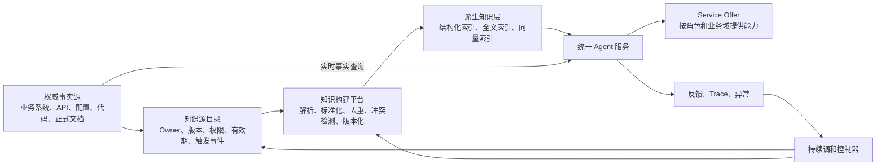

# 基于 IT4IT 的 Agent 知识治理

> 修订（2026-07-16）：本页由用户初稿评审收编，原稿经确认不留档，本页为唯一承载。相对初稿的补强：
> ①触发事件表补缺失的"权限/ACL 变更"并给出权限同步机制；②增量更新门禁补 eval 回归；
> ③新增评价指标；④新增知识风险分级（移植 [[论代码与文档漂移解决方案]] 的 T0–T4）；
> ⑤Agent Runtime 补实时查询 vs 索引检索的路由规则；⑥点明源系统成熟度前提；
> ⑦点破 Deploy≠Release 的知识暗发布窗口；⑧新增"与漂移方法论的关系"一节（本方案的理论支点）。

## 核心论点

把企业统一 Agent 问答系统当作 IT4IT 3.0 意义上的 Digital Product 建设：各业务系统保留权威事实，
中央平台只做接入、治理与派生索引；用 Digital Product Backbone（Product Design / Product Release /
Desired–Actual Product Instance）管理知识从设计、构建、发布、消费、运行到退役的全生命周期；
知识更新由业务变更事件驱动，业务方不再维护 Agent 专用知识副本。

## 一、与漂移方法论的关系（评审新增）

本方案是 [[论代码与文档漂移解决方案]] 在企业知识运维场景的实例化：知识生命周期状态机与该页 §八
完全一致；"知识索引不是 System of Record、只是可重建派生视图"即"派生视图可以重复展示、不能独立维护"
（[[代码与文档漂移的本质]]）的企业版；"取消业务方维护 Agent 专用知识副本"是表达漂移诊断
（重复副本 + 人工同步 = 必然漂移）的组织层应用。

综合（理论支点）：[[代码与文档漂移的本质]] 论证过四类漂移可治理程度悬殊，根因是**调和的前提是
两侧有共同形式表示**——运行漂移可解，因为 desired/actual 同构、可 diff。本方案借 IT4IT 的
Desired / Actual Product Instance 对象，给"应该提供什么知识"与"线上实际是什么知识"人为建出了
这个同构表示，**把企业知识失效问题从生命周期漂移（可治理程度：中）改造成运行漂移（高）**。
这是整个方案成立的支点。

边界：它治理的是知识作为派生视图的表达、生命周期与运行漂移；"Agent 回答是否符合业务意图"仍属
符合性漂移，只能靠 [[Evals]] 持续取证，不能靠调和消除。

## 二、建设目标与设计原则

目标：统一 Agent 入口与知识治理规则；业务系统保留权威事实源；取消 Agent 专用知识副本的定时人工维护；
业务变更事件自动更新知识；建立版本、权限、引用、冲突与生命周期机制；业务人员的工作收敛为
权威源确认与异常处理。

五条设计原则：

1. **统一治理，不集中生产事实**——事实继续在业务系统、配置中心、代码仓库和正式文档中维护。
2. **知识索引不是 System of Record**——向量库、全文索引、知识图谱均为可重建的派生视图。
3. **按产品生命周期管理知识**——知识更新挂在设计、发布、部署、运行、退役事件上，不建独立人工流程。
4. **Desired–Actual 持续调和**——持续 diff"应提供的知识状态"与"线上实际知识状态"，差异自动同步、
   下架或进异常处理。
5. **权限与生命周期随知识传递**——原始权限、生效/失效时间、版本、替代关系必须跟随知识进入 Agent。

**前提（评审补）**：事件驱动机制假设权威源"有版本、能发变更事件"（责任表也如此要求 Source System
Owner）。现实中大量权威事实住在无变更事件的 wiki / Word 文档里——对这类源，定时扫描不是"容灾手段"
而是实际主通道。实施应按源系统成熟度分级接入：有事件的系统走事件驱动；无事件的先纳入扫描，
同时推动源侧发布流程化，而非假设理想态。

### 过渡期的事实源配置（2026-08-27 补）

上文原则 1 与 2 规定“事实留在业务系统、索引只是派生视图”，但没有回答一个现实约束：
**既有系统（Jira、ServiceNow、需求工具、变更委员会）难以取代，恰恰因为审计与监管已经接受它们，
而且别的团队依赖它们。** Anthropic 的 AI-native SDLC playbook 给了一组更可操作的过渡配置
（[[2026-08-21-Anthropic-AI原生SDLC-playbook-源摘要]]），可直接移植到知识治理场景：

| 配置 | 做法 | 适用与代价 |
|---|---|---|
| **仓库为权威** | markdown / 知识对象是权威记录，legacy 系统只引用 commit SHA | 记录集中于一个工具、一个时间戳权威，最干净；要求 legacy 侧接受“指针化” |
| **legacy 系统为权威** | Jira / ServiceNow / 需求工具持有权威记录，派生知识是工作副本；agent 在会话开始时读取记录、结束时经 MCP 写回 | 审计与监管路径不变；代价是写回链路成为新的单点 |
| **链接为最低标准** | 双向互引：派生产物记录 record ID，legacy 记录含产物的 commit SHA | 原文措辞：“accepting that there are two sources of truth”——**显式承认双事实源**，作为迁移起点 |

> 综合：第三行值得单独记，因为它显式承认了双事实源。先厘清与本 wiki 铁律 7 的关系：
> 铁律 7 是**无条件禁令**，辖域仅为本仓库（wiki/ 单一写手、output/ 是派生视图、发出即冻结），
> 不含任何"声明或配了调和机制即可豁免"的限定；企业过渡期采用这一档，是**辖域不同**，
> 不是对铁律 7 的例外或改写。这一档在企业场景的合理性，应对照 [[代码与文档漂移的本质]] 的
> 调和原则来论证：**调和的前提是两侧有共同的形式表示**——双向可解析的显式引用
> （record ID ↔ commit SHA）正是给两份记录人为建出的最弱共同表示，使分歧从不可见变为
> **可被程序发现**（一条可 lint 的断链检查），亦即 [[论代码与文档漂移解决方案]] §五
> 关系契约（`derived_from`）的最弱可验证版本。
>
> 但它是**过渡态而非终局**：双源仍会各自演化，链接只保证“能发现分歧”，不保证“分歧会被解决”。
> 因此采用这一档时必须同时约定收敛期限与责任人，否则它会稳定成永久的双写。

## 三、总体架构



## 四、IT4IT 核心对象映射

| IT4IT 对象 | 本方案映射 |
|---|---|
| Digital Product | 企业统一 Agent 问答系统 |
| Product Design | 知识域模型、权威源规则、检索策略、权限策略、引用规则、Eval 设计 |
| Product Release | 模型、Prompt、连接器、索引规则、知识版本和 Eval 的发布组合 |
| Desired Product Instance | 某环境应接入的权威源、版本、权限、有效期和规则 |
| Actual Product Instance | 线上实际连接器、索引、模型、Prompt、权限和知识状态 |
| Service Offer | 研发助手、客服助手、销售助手、运维助手等服务能力 |
| Subscription / Contract | 用户范围、知识范围、操作权限和服务责任边界 |

Digital Product Backbone 与下节七条价值流均为 IT4IT 3.0 正式概念（The Open Group；3.0.1 维护版
2024-10 发布：https://publications.opengroup.org/c24a ，检索于 2026-07-16）。

## 五、七条价值流

| IT4IT Value Stream | 方案活动 | 主要产物 |
|---|---|---|
| Evaluate | 确定 Agent 产品定位、业务范围和建设优先级 | Agent 产品组合、领域规划 |
| Explore | 梳理问题场景、权威源、知识边界、权限和风险 | Product Design、知识源目录、知识 Backlog |
| Integrate | 建设连接器，完成解析、去重、版本化、权限处理和知识构建 | 可发布的知识构建包 |
| Deploy | 将模型、Prompt、连接器、索引和规则部署到目标环境 | Desired Product Instance |
| Release | 完成发布审核，向指定用户开放 Agent 能力 | Product Release、Service Offer |
| Consume | 用户鉴权、提问、检索、引用、实时查询和反馈 | 查询记录、回答、引用、反馈 |
| Operate | 监控线上知识状态，处理过期、冲突、权限漂移和异常 | Actual Product Instance、事件、问题、调和任务 |

**Deploy ≠ Release 的红利（评审补）**：IT4IT 把"部署到环境"与"向用户开放"分为两条价值流，
知识场景可直接利用——新知识先 Deploy（进索引但对用户不可见），跑 eval 回归与引用检查，
通过后再 Release 开放。知识由此获得与代码同等的暗发布验证窗口。初稿结构上支持但未点破。

## 六、功能组件

1. **Digital Product Catalog**：Agent 产品及业务域、Product Owner、产品生命周期、
   Product Design / Product Release、服务依赖与知识域关系。
2. **Knowledge Source Registry**：每个知识源登记权威地址、所属产品与领域、Owner、来源类型、
   当前版本、生效/失效时间、访问权限、更新触发事件、替代关系、生命周期状态。
3. **Knowledge Build Platform**：多源连接器、文档与数据解析、结构标准化、增量变更识别、
   重复内容合并、冲突发现、知识版本管理、索引构建与删除、引用关系生成。
4. **Reconciliation Controller**：diff Desired 与 Actual Product Instance；识别缺失、过期、
   版本错误；触发增量同步或索引重建；下架失效知识；无法自动处理的进异常队列
   （自动/人审边界按 §九 风险分级）。
5. **Release Control**：模型版本、Prompt 版本、Agent 编排规则、数据连接器、知识源版本、索引配置、
   权限策略、Eval 版本捆成**原子发布**。**禁止只更新知识索引而不记录对应 Product Release**——
   全案最有牙齿的治理规则，堵住企业 RAG 最常见的失控点："索引悄悄变了，没人知道线上 Agent
   行为为何变化"。
6. **Service Offer Management**：按业务域与用户角色定义可访问知识域、可用 Agent 能力、
   是否允许实时调用与写操作、人工确认要求、数据与权限边界。
7. **Agent Runtime**：在线问答时依次执行——
   1. 用户身份和权限确认；
   2. 查询意图及业务域识别；
   3. **路由**（评审补规则）：高变化率或强权威要求的事实（库存、价格、工单状态、个人数据）
      实时查询权威 API；稳定解释性知识（流程、政策解读、操作指南）走索引检索——
      即 [[代码与文档漂移的本质]]"按变化率匹配载体"原则的运行时版；
   4. 按版本、有效期和权限过滤知识；
   5. 生成带来源引用的回答；
   6. 存储回答 Trace 和用户反馈；
   7. 对冲突或无有效来源的问题拒绝确定性回答。

## 七、知识更新机制

```text
权威源发生变化
    ↓
标准变更事件
    ↓
识别受影响的知识对象和 Service Offer
    ↓
更新 Desired Product Instance
    ↓
增量解析和构建知识
    ↓
门禁：权限、引用、冲突、eval 回归（评审补）、发布检查
    ↓
更新 Actual Product Instance
    ↓
旧版本下架或退役
```

初稿的门禁只有"权限、引用、冲突和发布检查"。知识变更是最高频路径，恰恰最需要自动回归
[[Evals|eval]]（召回质量、引用正确性），否则调和控制器会高效地把坏知识同步上线。

**触发事件**：Product Design 变更；Product Release 创建；API 或 Schema 变更；配置中心变更；
正式文档发布；产品部署；服务发布；政策生效或失效；**源系统权限/ACL 变更**（评审补——初稿遗漏；
这是"越权召回"这一企业 Agent 头号事故源的入口事件）；产品退役；用户纠错或生产事件。

**权限同步机制（评审补）**：权限作为索引元数据随知识写入、查询时过滤；ACL 变更事件触发对应索引项的
权限元数据重建；高敏感知识域在查询时额外回查权威 ACL 实时校验，不信任索引侧副本。

定时扫描作为遗漏检测与无事件源的兜底通道（见 §二前提）。

## 八、知识生命周期

```text
Draft → Active → Superseded → Depublished → Deleted
                                      └── Archived
```

状态机与 [[论代码与文档漂移解决方案]] §八 一致，各状态语义不再重复维护。企业语义差异仅两处：
`Deleted` 的恢复能力由历史系统（而非 Git）承担；`Archived` 仅用于法规、审计和长期复现。

## 九、知识风险分级（评审新增）

初稿的调和控制器对所有知识一视同仁，未回答"什么可自动下架、什么必须人审"。移植
[[论代码与文档漂移解决方案]] §九 的 T0–T4 到知识场景：

| 等级 | 知识类型 | 默认行为 |
|---|---|---|
| T0 | 纯派生索引、自动生成摘要 | 自动更新、自动下架、自动重建 |
| T1 | 断链、指向已退役源的索引项 | 验证后自动清理 |
| T2 | 有完整替代版本的普通知识 | 满足确定性替代条件（显式 supersedes + 引用已迁移 + 保留期届满）时自动下架 |
| T3 | 业务规则、流程、产品能力描述 | 自动更新；下架需 Domain Owner 确认 |
| T4 | 政策、法务、安全、合规知识 | 生效/失效仅随权威政策事件；一切变更人审 |

高风险事项不阻塞系统：无法自动证明安全的修改标记为异常、退出默认检索，其余低风险任务继续。

## 十、责任划分

| 角色 | 责任 |
|---|---|
| Agent Digital Product Manager | 统一 Agent 的产品规划、生命周期和服务范围 |
| Domain Product Owner | 确认领域权威源、业务规则、知识边界和发布要求 |
| Agent Platform Team | 连接器、知识构建、检索、权限、调和和发布能力 |
| Source System Owner | 保证权威系统可访问，提供版本或变更事件 |
| Service Owner / SRE | 生产实例、事件、问题和恢复 |
| Domain Expert | 知识冲突、政策解释和高风险异常（T3/T4，见 §九） |

业务团队不再维护 Agent 专用知识副本，只负责：指定权威来源；在正常产品流程中维护业务事实；
审核高风险规则；处理机器无法裁决的异常。

## 十一、评价指标（评审新增）

初稿未回答"怎么知道治理在起作用"。目标形态沿用 [[论代码与文档漂移解决方案]] §十二
（没有静默漂移、没有无限期漂移、没有不可追溯的漂移），知识场景追加一条：**没有越权的知识暴露**。

- 过期知识在线时长（Superseded / 失效后仍可被检索的时间）
- 权威源变更 → 索引生效的延迟
- 回答引用覆盖率（带可解析来源引用的回答占比）
- 越权召回次数（权限过滤失效事件）
- 异常队列积压量与处理时长
- 无权威来源的索引项数量
- 调和自动完成率（自动处理 vs 转人工比例）

## 十二、实施路径

1. **产品建模**：注册 Digital Product，明确 Product Owner 与 Service Owner，定义首批 Service Offer，
   选一个业务域试点，建立 Product Design 和知识源目录。
2. **构建 Digital Product Backbone**：建立 Digital Product → Design → Release → Desired/Actual
   Instance 关系；按源成熟度分级接入首批权威源（见 §二前提）；建知识源元数据与生命周期模型；
   打通统一身份和权限传递。
3. **打通价值流**：知识变更接入 Integrate / Deploy / Release；产品发布事件自动关联知识更新；
   模型、Prompt、连接器和知识版本纳入同一 Product Release；建立 Service Offer 发布订阅机制。
4. **持续运营**：上线 Desired–Actual 调和控制器；建过期、冲突、权限异常队列；用户反馈与生产问题
   回流 Explore 与 Integrate；建立产品和知识退役机制；按业务域扩展 Service Offer。

## 十三、与 Agent 知识—记忆—行动闭环的接口

[[从知识图谱到 Agent 编排]] 将本页的治理方案放入更大的运行闭环：

- 权威业务系统与正式文档属于“权威事实层”；
- 全文、向量和 [[知识图谱]] 属于“派生表示层”；
- Runtime 的实时 API / 索引路由属于“检索与证据层”；
- Agent 的 [[Agent 记忆架构|语义和程序记忆]] 只能消费或蒸馏已治理知识，不能反过来冒充事实源；
- [[MCP]]、API 与 [[RPA]] 属于“集成与行动层”；
- 本页的 Release Control、Desired–Actual diff、Eval 与退役机制构成“验证与调和层”。

综合：知识架构若缺少本页的生命周期治理，Agent 会更快地检索和执行过时、错误或越权知识；
Agent 能力越强，权威源与派生视图的边界反而越重要。

## 十四、Knowledge Catalog 与 OKF 的落位

Google Cloud Knowledge Catalog 与 [[Open Knowledge Format|OKF]] 分别对应治理系统和可携带制品，
不能因为它们出现在同一 GitHub 仓库就视为同一种能力：

| 对象 | 在本方案中的位置 | 权威边界 |
|---|---|---|
| Google Cloud Knowledge Catalog | Knowledge Source Registry、部分派生知识层和元数据变更入口的候选实现 | 可治理 Entry、Aspect、Glossary 等目录元数据；不自动成为订单、代码、政策正文的事实源 |
| `mdcode` | Integrate / Deploy 阶段的 Metadata as Code 适配器 | pull/diff/push 只是同步机制，仍受 Release 与 Desired–Actual 控制 |
| OKF Bundle | 可纳入 Product Release 的知识发布/交换制品 | 是可重建派生物；格式合规不等于业务发布获批 |
| Reference Agent | Knowledge Build Platform 的知识编译器 PoC | 生成候选知识，不能自行授予 verified 或高风险发布资格 |
| Attested Computation | Agent Runtime 与验证门禁之间的逐次计算契约 | 证明某次结果按批准方式生成，不证明定义本身仍符合政策 |

Knowledge Catalog 已具备有类型关系、Aspect、IAM 体系与 metadata change feed；OKF v0.2 则强调文件可读、
Git diff、来源和保鲜信号，但没有对应的访问控制、正式发布和变更调和能力。两者可以通过适配器互补，
不能互相替代。

综合：若企业采用 OKF，最稳健的方式是把它作为 Product Release 中的**可审阅知识包**：
权威源和目录控制 Desired，构建流水线生成 Bundle，门禁检查来源、权限、断链、核验和 Eval，
发布后由 Actual 状态监控保鲜与退役。当前仓库的 OKF custom Aspect 只是局部映射示例，
尚不足以证明与 Knowledge Catalog 的全字段双向调和。

## 参考

- The Open Group IT4IT Standard, Version 3.0.1（2024-10）：https://publications.opengroup.org/c24a （检索于 2026-07-16，已核实）
- IT4IT 七条价值流（官方文档）：https://digital-portfolio.opengroup.org/it4it-standard/latest/DigitalManagement/seven-it4it-value-streams.html （检索于 2026-07-16）
- Google Cloud Knowledge Catalog 元数据模型与变更事件：https://docs.cloud.google.com/dataplex/docs/catalog-overview （检索于 2026-07-28）
- OKF v0.2：https://github.com/GoogleCloudPlatform/knowledge-catalog/blob/main/okf/SPEC.md （检索于 2026-07-28）
